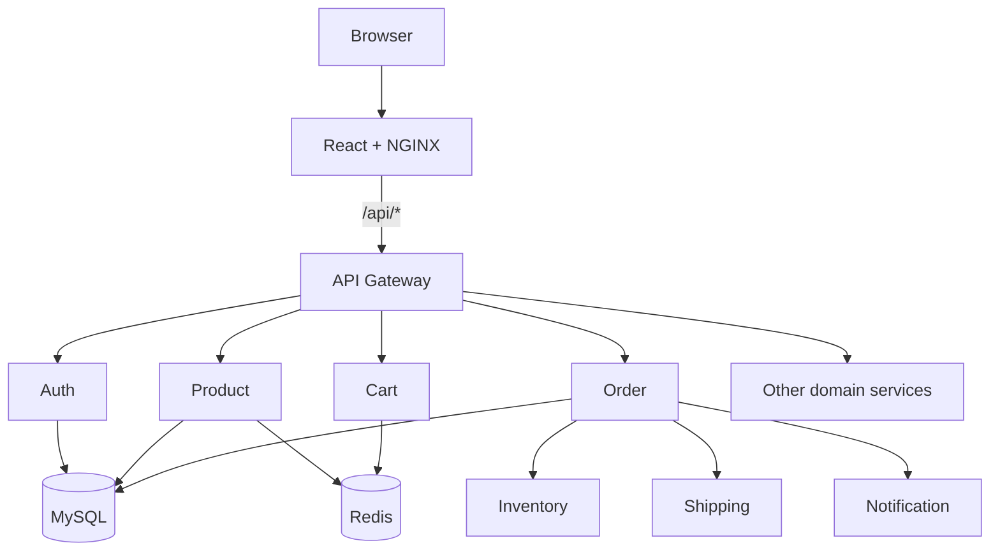
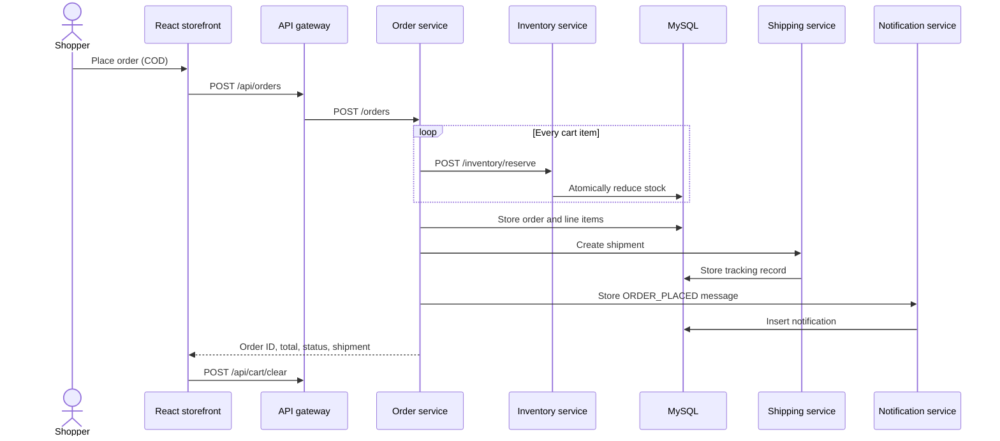
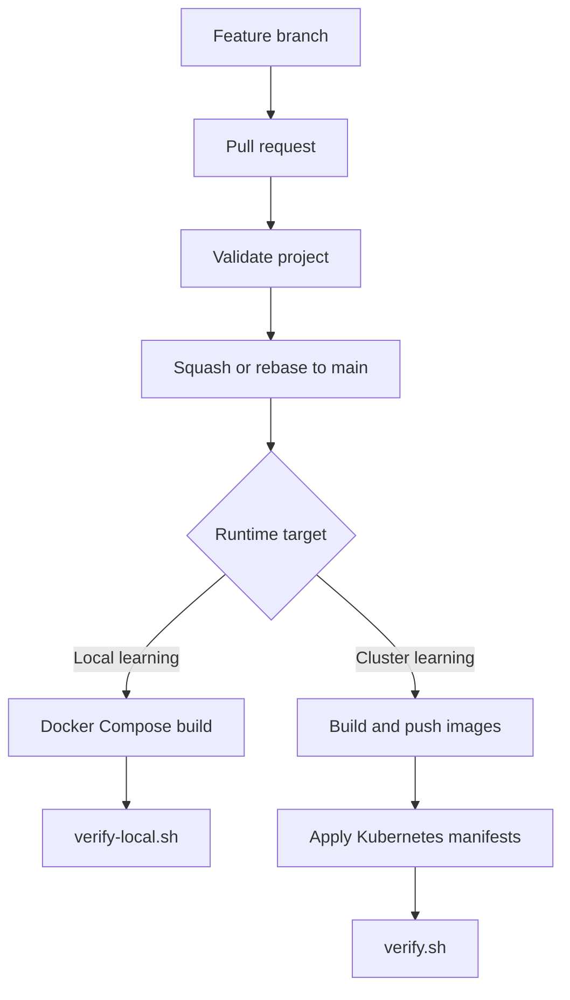

<div align="center">

# MJ's Cart

### A learning-first e-commerce microservices platform

Build, run, observe, and deploy a complete React + Node.js system with an API gateway, nine domain services, MySQL, Redis, Docker Compose, Kubernetes, and Prometheus.

[](https://github.com/jeevanm84/mjcart-ecommerce-microservices/actions/workflows/ci.yml)
[](LICENSE)
[](https://github.com/jeevanm84/mjcart-ecommerce-microservices/stargazers)

[Complete end-to-end guide](docs/END_TO_END_GUIDE.md) · [Quick start](#quick-start) · [Learning paths](#choose-your-learning-path) · [Architecture](docs/ARCHITECTURE.md) · [Code structure](docs/CODE_STRUCTURE.md) · [API reference](docs/API.md) · [Contributing](CONTRIBUTING.md)

</div>

> [!NOTE]
> This is an educational, production-style reference project—not a production-ready commerce system. Checkout uses Cash on Delivery (COD); the project never accepts or stores card data.

> [!TIP]
> New here? Follow the **[complete end-to-end guide](docs/END_TO_END_GUIDE.md)** as the single canonical document—from GitHub login through local verification, pull request, merge, visibility setup, and optional Kubernetes deployment.

## Why this project exists

Most microservices examples show isolated snippets. MJ's Cart shows how the pieces fit together: a browser request crosses NGINX and an API gateway, reaches independently deployable services, changes state in MySQL or Redis, and exposes health and Prometheus endpoints for operations.

You can use it to:

- learn microservices locally with one Docker Compose command;
- practice API gateway, database-per-service, caching, and orchestration patterns;
- study Docker and Kubernetes manifests from a working example;
- prepare a system-design or DevOps walkthrough;
- contribute approachable improvements to an open-source project.

## Quick start

### Prerequisites

- Git
- Docker Desktop or Docker Engine with Compose v2
- 6 GB or more of memory available to Docker
- `curl` for the optional smoke test

### Run the complete application

```bash
git clone https://github.com/jeevanm84/mjcart-ecommerce-microservices.git
cd mjcart-ecommerce-microservices
cp .env.example .env
docker compose up --build -d
```

Wait until MySQL finishes its first-time initialization, then open:

- Storefront: <http://localhost:3000>
- API gateway: <http://localhost:8080>
- Product API: <http://localhost:3000/api/products>

Verify the important paths:

```bash
./scripts/verify-local.sh
```

Stop the application without losing local database data:

```bash
docker compose down
```

For logs, resets, troubleshooting, and the manual-development workflow, see the [complete getting-started guide](docs/GETTING_STARTED.md).

## Choose your learning path

| Experience | Start here | What you will learn |
|---|---|---|
| Beginner | [Run your first order](docs/GETTING_STARTED.md#your-first-guided-demo) | Containers, API calls, logs, and service boundaries |
| Intermediate | [Trace a checkout](docs/LEARNING_PATHS.md#intermediate-trace-a-checkout) | Gateway routing, Redis, MySQL, and service-to-service calls |
| Experienced | [Production-readiness review](docs/LEARNING_PATHS.md#experienced-production-readiness-review) | Reliability gaps, security boundaries, observability, and scaling trade-offs |

## Architecture at a glance



The gateway exposes nine domain APIs. Every backend includes `/health`, `/ready`, and `/metrics` endpoints. The [architecture guide](docs/ARCHITECTURE.md) explains ownership, request flows, data boundaries, and deliberate trade-offs.

### Checkout flow



This synchronous teaching flow deliberately exposes distributed-transaction trade-offs. See [Architecture](docs/ARCHITECTURE.md#checkout-sequence-and-failure-boundary) for the failure boundary and production extensions.

## Services

| Component | Responsibility | Data store |
|---|---|---|
| `frontend` | Storefront and project UI | — |
| `api-gateway` | Routes `/api/*` requests | — |
| `auth-service` | Registration, login, JWT validation | MySQL |
| `user-service` | Customer profiles | MySQL |
| `product-service` | Product catalog and list caching | MySQL + Redis |
| `inventory-service` | Stock lookup and reservation | MySQL |
| `cart-service` | Expiring customer carts | Redis |
| `order-service` | COD checkout orchestration | MySQL |
| `shipping-service` | Shipment creation and tracking | MySQL |
| `notification-service` | Stored order notifications | MySQL |
| `review-service` | Product reviews | MySQL |

## Code structure and change guide

```text
.
├── frontend/
│   ├── src/main.jsx        Storefront state, screens, and API calls
│   ├── src/style.css       Responsive visual design
│   └── nginx.conf          Serves React and proxies /api to the gateway
├── services/
│   ├── api-gateway/        Public /api/* routing boundary
│   └── *-service/          One server.js, package, and Docker image per domain
├── database/init.sql       Local schemas and seed data
├── k8s/                    Namespace, data stores, workloads, ingress, monitoring
├── scripts/                Build, deploy, verify, and kOps lifecycle helpers
├── docs/                   Guided learning and technical reference
├── docker-compose.yml      Complete local dependency graph
└── Makefile                Friendly entry points for common tasks
```

| Change you want | Start here | Then verify |
|---|---|---|
| Storefront behavior or styling | `frontend/src/main.jsx`, `frontend/src/style.css` | Browser plus `make verify` |
| Public API route | `services/api-gateway/server.js` | [Gateway route map](docs/API.md#gateway-route-map) |
| Domain behavior | `services/<domain>-service/server.js` | Service health and relevant API call |
| Database shape or seed data | `database/init.sql` | Recreate local volumes with `make clean` |
| Local runtime wiring | `docker-compose.yml`, `.env.example` | `make up`, `make status`, `make verify` |
| Kubernetes deployment | `k8s/`, `scripts/deploy.sh` | [Deployment runbook](docs/RUNBOOK.md) |
| CI validation | `.github/workflows/ci.yml` | Open a pull request and inspect `Validate project` |

The [complete code-structure guide](docs/CODE_STRUCTURE.md) traces a request from React to storage and gives a safe checklist for adding a service or endpoint.

### From change to running system



## Common commands

```bash
make help      # discover commands
make up        # build and start everything
make status    # inspect containers
make logs      # follow all logs
make verify    # run local smoke checks
make down      # stop and preserve data
make clean     # stop and delete local data
```

## Kubernetes deployment

The repository includes a self-managed Kubernetes path using kOps on AWS. It creates real cloud resources and can incur charges. Read the [deployment runbook](docs/RUNBOOK.md) before running any cluster script.

## Project status and boundaries

MJ's Cart demonstrates infrastructure and integration patterns in compact code. Important production concerns—authorization enforcement, input schemas, migrations, distributed transactions, retries, tracing, TLS, secret management, automated tests, and high availability—remain intentional extension points. See the [experienced learning path](docs/LEARNING_PATHS.md#experienced-production-readiness-review).

## Portfolio roadmap

MJ's Cart is the capstone system in the [jeevanm84 engineering portfolio](https://github.com/jeevanm84). Build the supporting capabilities in this order:

```text
Git foundations → Terraform infrastructure → Packer images
→ Kubernetes platform engineering → MJCart integration and operations
```

- [Git Command Master Map](https://github.com/jeevanm84/git-command-master-map) — collaboration, recovery and debugging foundations
- [Terraform AWS HA Web Platform](https://github.com/jeevanm84/terraform-aws-ha-web-platform) — modular AWS infrastructure, tests, state and OIDC
- [Packer AWS Golden Image Pipeline](https://github.com/jeevanm84/packer-aws-golden-image-pipeline) — immutable-image lifecycle and verification
- [Kubernetes Zero to Production](https://github.com/jeevanm84/kubernetes-zero-to-production) — secure local workloads, failure labs, GitOps and production architecture

## Contributing

Contributions from first-time and experienced contributors are welcome. Start with [CONTRIBUTING.md](CONTRIBUTING.md), use the issue templates, and keep each pull request focused. Please follow the [Code of Conduct](CODE_OF_CONDUCT.md) and report vulnerabilities through [SECURITY.md](SECURITY.md).

## Author

Created and maintained by [@jeevanm84](https://github.com/jeevanm84). If this project helps you, consider starring it, sharing what you learned, or contributing an improvement.

## License

Released under the [MIT License](LICENSE).
