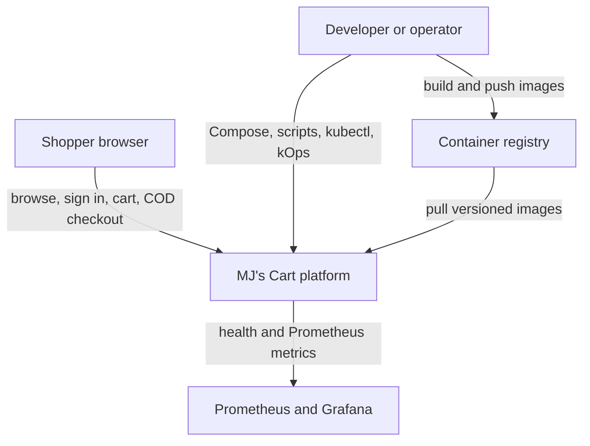
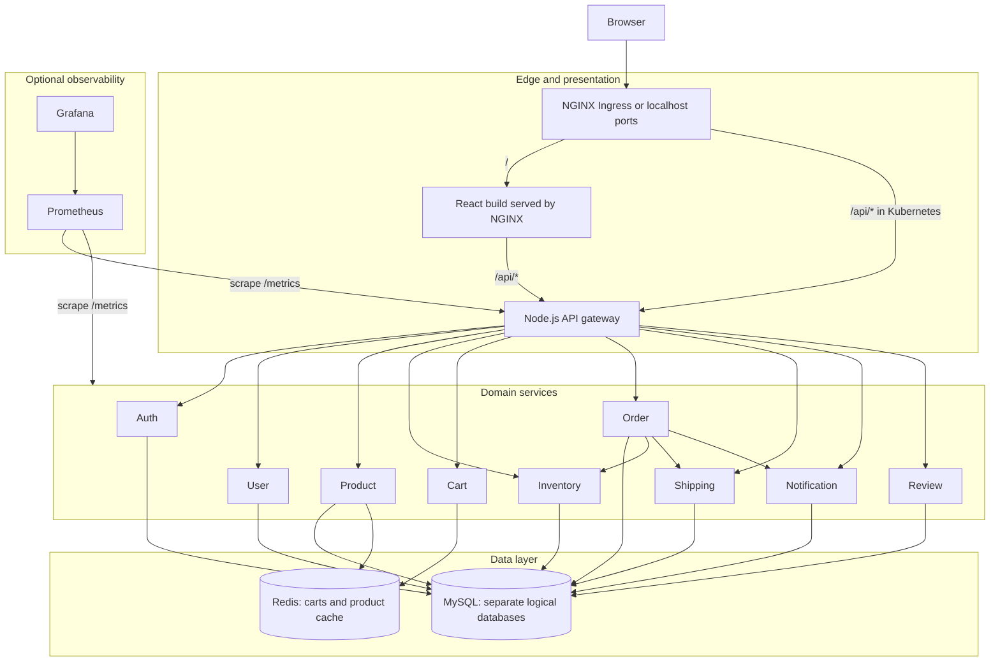
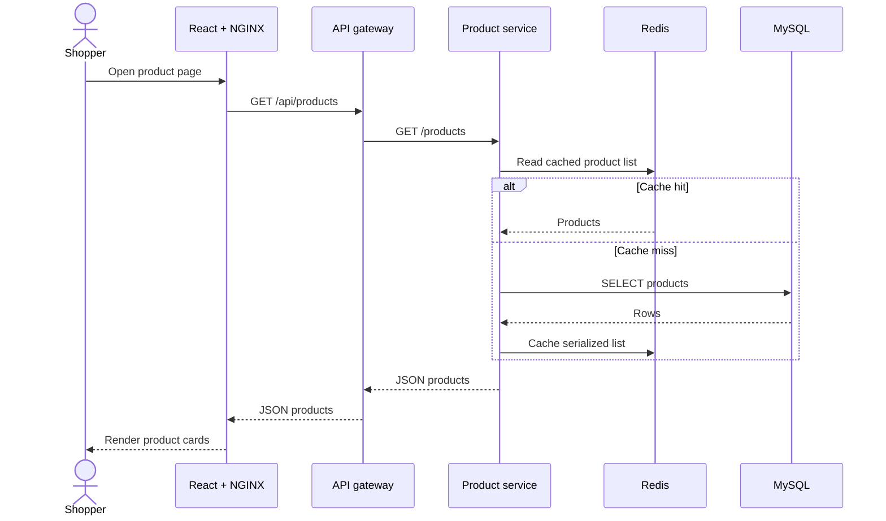
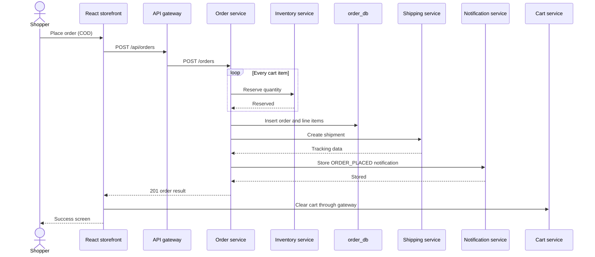
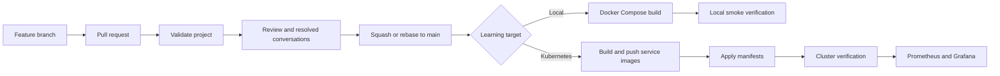

# MJ's Cart architecture

MJ's Cart is a learning-first, production-style microservices system. It runs the same logical components through Docker Compose locally and Kubernetes for the cluster learning path. Checkout is Cash on Delivery (COD): there is no payment service, payment route, or card-data flow.

Use this document for runtime relationships and design boundaries. Use [Code structure](CODE_STRUCTURE.md) to locate implementation files and [API reference](API.md) for endpoint contracts.

## System context

## Runtime architecture

The frontend NGINX configuration proxies same-origin `/api` calls in the local container. Kubernetes Ingress can route `/` to the frontend and `/api` to the gateway. Domain workloads stay behind ClusterIP services.

## Service ownership

| Component | Owns | Storage | Calls |
|---|---|---|---|
| API gateway | Public routing and gateway metrics | None | All domain services |
| Auth service | Registration, login, JWT creation/validation | `auth_db` | None |
| User service | Customer profiles | `user_db` | None |
| Product service | Catalog and product-list caching | `product_db`, Redis | None |
| Inventory service | Stock and atomic reservation | `inventory_db` | None |
| Cart service | Per-user carts with expiry | Redis | None |
| Order service | COD orders, line items, checkout orchestration | `order_db` | Inventory, Shipping, Notification |
| Shipping service | Shipments and tracking numbers | `shipping_db` | None |
| Notification service | Stored order notifications | `notification_db` | None |
| Review service | Product reviews | `review_db` | None |

Every backend exposes `/health`, `/ready`, and `/metrics`. The gateway has no `/api/payments` mapping, and the order service always persists `payment_method = "COD"`.

## Read request flow

## Checkout sequence and failure boundary

This is a deliberately synchronous teaching implementation, not an atomic distributed transaction. If inventory succeeds and a later call fails, automatic compensation is not implemented. A production evolution would introduce idempotency keys, an outbox, asynchronous events, retries with backoff, a checkout saga, and compensating inventory release.

## Local and Kubernetes mapping

| Concern | Docker Compose | Kubernetes |
|---|---|---|
| Definition | `docker-compose.yml` | `k8s/*.yaml` |
| Discovery | Compose service names | Kubernetes Services and cluster DNS |
| External entry | Frontend `:3000`, gateway `:8080` | Ingress routes `/` and `/api` |
| MySQL persistence | Named `mysql-data` volume | StatefulSet/PVC |
| Configuration | `.env` and service environment | ConfigMaps, Secrets, workload environment |
| Health | Compose dependency health checks | Liveness/readiness probes |
| Verification | `scripts/verify-local.sh` | `scripts/verify.sh` |
| Lifecycle | `make up/down/clean` | Deploy and Kubernetes/kOps lifecycle scripts |

## Delivery flow

The protected `main` ruleset requires the `Validate project` check, linear history, resolved conversations, and pull requests. Operational deployment remains deliberate rather than automatic because the Kubernetes path can create billable AWS resources.

## Security and trust boundaries

- The browser should reach backend domains only through the API gateway.
- JWT issuance exists, but most domain routes do not yet enforce authorization; this is an explicit teaching boundary.
- Local `.env` values and Kubernetes sample Secrets are development examples, not production secret management.
- MySQL databases are logically separated, but share one server in the learning topology.
- Inter-service traffic is plain HTTP inside the learning network.
- The system stores no card data because checkout is COD only.
- Kubernetes and kOps scripts can create real resources; follow [RUNBOOK.md](RUNBOOK.md) and verify the active AWS account first.

## Production evolution

An enterprise implementation would add schema validation, authorization middleware, migrations, per-service database infrastructure, TLS, managed secrets, rate limiting, traces, centralized logs, circuit breakers, idempotency, saga/outbox messaging, autoscaling, disruption budgets, network policies, backups, disaster recovery, and automated unit/integration/contract tests.
