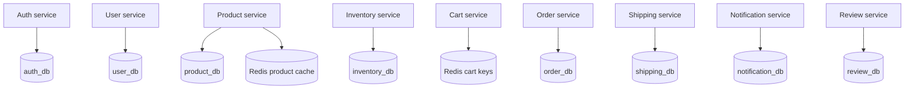

# Code structure

This guide answers three questions before you edit MJ's Cart:

1. Which directory owns the behavior?
2. How does a request move through the code?
3. What must be updated and verified with the change?

For runtime topology, security boundaries, and checkout sequencing, read [Architecture](ARCHITECTURE.md). For endpoint contracts, read the [API reference](API.md).

## Repository tree

```text
.
├── frontend/
│   ├── src/
│   │   ├── main.jsx             React application and API client
│   │   └── style.css            Storefront styles and responsive layout
│   ├── nginx.conf               Static hosting and /api reverse proxy
│   ├── Dockerfile               Vite build followed by NGINX runtime
│   └── package.json             Frontend dependencies and scripts
├── services/
│   ├── api-gateway/             Public routing, gateway metrics, 502 handling
│   ├── auth-service/            Registration, login, JWT creation/validation
│   ├── user-service/            Customer profile data
│   ├── product-service/         Catalog and Redis list cache
│   ├── inventory-service/       Stock lookup, upsert, and reservation
│   ├── cart-service/            Expiring Redis-backed carts
│   ├── order-service/           COD checkout orchestration and history
│   ├── shipping-service/        Shipment and tracking records
│   ├── notification-service/    Stored platform notifications
│   └── review-service/          Product ratings and comments
├── database/
│   └── init.sql                 Local databases, tables, and sample products
├── k8s/
│   ├── namespace.yaml           mjcart namespace
│   ├── mysql*.yaml              MySQL configuration, secret, PVC, and workload
│   ├── redis.yaml               Redis workload and service
│   ├── backend.yaml             Gateway and domain workloads/services
│   ├── frontend.yaml            Storefront workload and service
│   ├── ingress.yaml             / and /api external routing
│   └── monitoring-optional.yaml Optional Prometheus and Grafana resources
├── scripts/
│   ├── verify-local.sh          Local Compose smoke checks
│   ├── build-push.sh            Container registry build and push
│   ├── deploy.sh                Kubernetes manifest deployment
│   ├── verify.sh                Cluster verification
│   └── *-kops-cluster.sh        AWS kOps create/delete lifecycle
├── docs/                        Learning paths, API, architecture, and runbooks
├── docker-compose.yml           Local services, dependencies, ports, and volumes
├── .env.example                 Safe local configuration template
└── Makefile                     Human-friendly commands over scripts and Compose
```

Generated folders such as `frontend/node_modules/`, `frontend/dist/`, IDE metadata, and runtime volumes are not part of the source design.

## Request path through the code

```mermaid
flowchart LR
    A[Browser action] --> B[frontend/src/main.jsx]
    B -->|fetch /api/...| C[frontend/nginx.conf]
    C --> D[services/api-gateway/server.js]
    D --> E[services/domain-service/server.js]
    E --> F{Storage}
    F -->|durable domain data| G[(MySQL database)]
    F -->|cart or product cache| H[(Redis)]
    E --> I[/health /ready /metrics]
```

The React helper in `frontend/src/main.jsx` sends same-origin `/api` requests. NGINX forwards those calls to the gateway. The gateway replaces the public prefix with the service's internal prefix and proxies to a Docker Compose or Kubernetes service name. The selected service owns the business behavior and storage access.

## Service convention

Every directory under `services/` is independently containerized and intentionally compact:

| File | Responsibility |
|---|---|
| `server.js` | Express routes, domain logic, dependency clients, health, readiness, and metrics |
| `package.json` | Runtime dependencies and start command |
| `package-lock.json` | Reproducible dependency versions |
| `Dockerfile` | Minimal service container image |

The API gateway is the only public backend entry point. Domain services are addressed by internal names such as `http://product-service:3000`. Do not add browser-to-service shortcuts; route new public APIs through the gateway.

## Data ownership



The local environment runs one MySQL server for convenience, but each MySQL-backed service uses a separate logical database. Services should exchange API calls rather than query another service's tables.

## Add or change an endpoint

1. Define the domain route in the owning `services/<domain>-service/server.js`.
2. Keep input validation and errors close to that route.
3. Add or update the matching `/api` proxy in `services/api-gateway/server.js` when the public prefix changes.
4. Update the frontend call in `frontend/src/main.jsx` if the UI consumes it.
5. Update [API.md](API.md) with method, path, input, response, and failure behavior.
6. If dependencies or environment variables changed, update both `docker-compose.yml` and `k8s/backend.yaml`.
7. Extend `scripts/verify-local.sh` with a stable smoke check.
8. Run `make verify` and open a pull request so `Validate project` runs.

## Add a new service

In addition to the endpoint checklist:

1. create a new `services/<name>-service/` package and Dockerfile;
2. add its database schema to `database/init.sql` only if it needs durable storage;
3. wire service dependencies and health ordering in `docker-compose.yml`;
4. add its Deployment and ClusterIP Service to `k8s/backend.yaml`;
5. add its gateway target environment variable and route;
6. expose `/health`, `/ready`, and `/metrics` consistently;
7. document ownership in the README service table and [ARCHITECTURE.md](ARCHITECTURE.md);
8. account for its image in `scripts/build-push.sh` and deployment workflow.

## Review checklist

- The change has one clear domain owner.
- No service reads another service's database directly.
- No credentials, generated dependencies, build output, or local volumes are committed.
- Compose and Kubernetes wiring remain consistent.
- Public behavior and API documentation agree.
- Health, readiness, metrics, and smoke checks still represent the behavior.
- Checkout remains Cash on Delivery; there is no payment API or card-data path.
